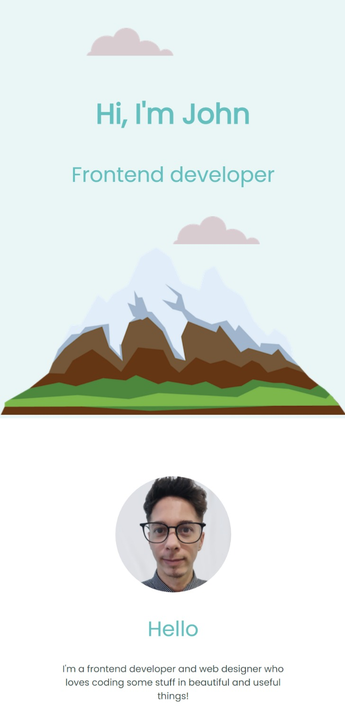

# Personal Site

 This is a simple perosnal site that was created at The Complete Web Development Course by Angela Yu.

 ## Contents

- [Overview](#overview)
    - [The project](#the-project)
    - [Responsive design](#responsive-design)
    - [Links](#links)
- [My process](#my-process)
    - [Built with](#built-with)
    - [What I learned](#what-i-learned)
    - [Author](#author)

## Overview

### The Project

A simple and beautiful project for a personal site using only HTML and CSS.

### Responsive Design

### Links

See the project online: [Personal Site](https://joaovsbraz.github.io/personal-site/)

## My Process

### Built With

- HTML
- CSS

### What I Learned

It is a simple project, but I also had comprehended a little bit more the box sizing.

### Author

- Twitter: [Angela Yu](https://twitter.com/yu_angela)